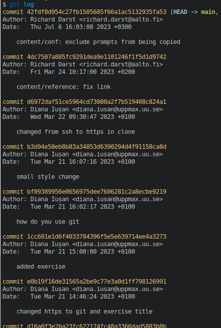
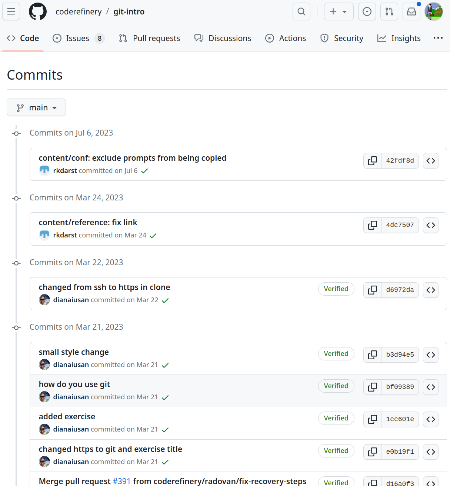
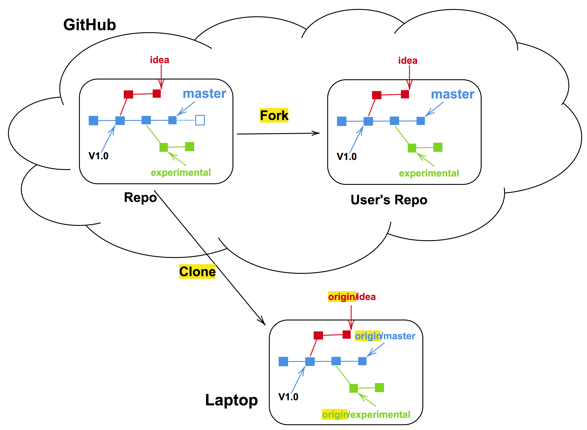
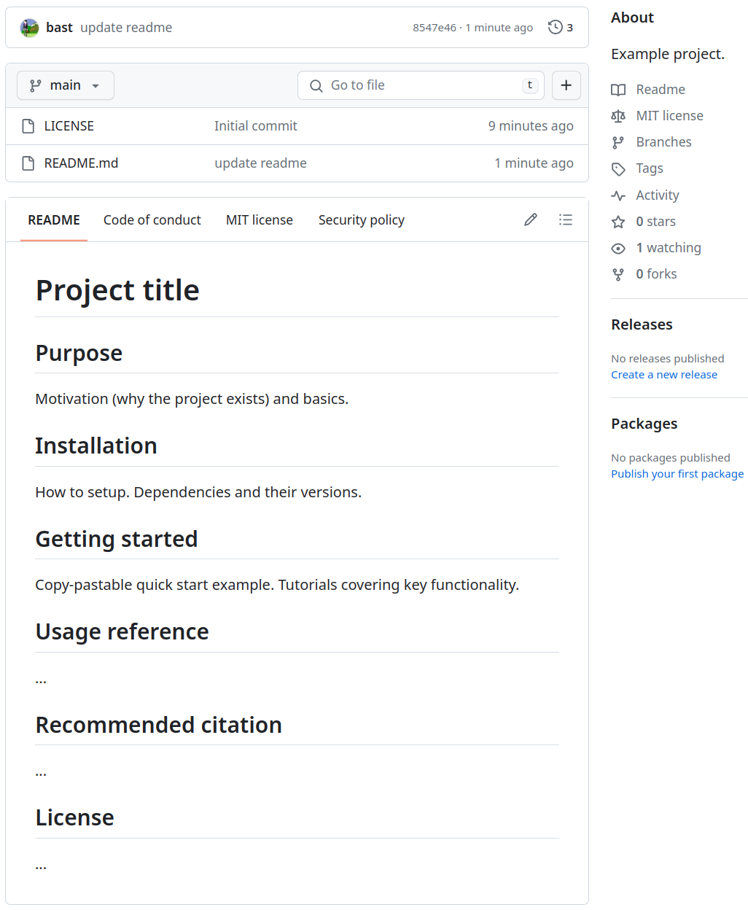
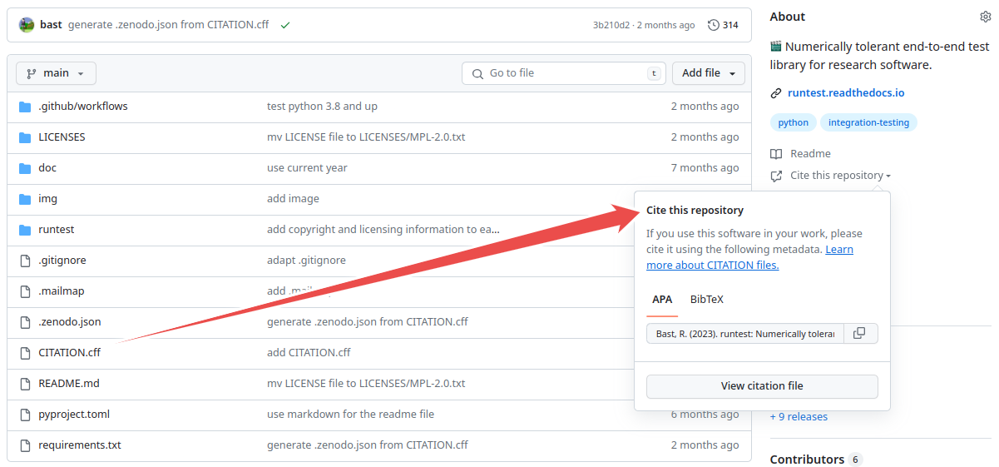

class: center, middle, gray-background

# Research software engineering for HPC

## Radovan Bast ([fosstodon.org/@radovan](https://fosstodon.org/@radovan))

### UiT The Arctic University of Norway


&nbsp;


Text: CC-BY 4.0

---

# About me

.left-column30[

]

.right-column70[
- Theoretical chemist turned research software engineer.

- I write research software and teach programming to researchers and lead the
  [CodeRefinery project](https://coderefinery.org).

- I lead the [high-performance computing group](https://hpc.uit.no) and the
  [research software engineering group](https://research-software.uit.no) at UiT.
]

---

# What is "research software"?

.left-column50[
- Script to convert data from one format to another

- Script to read data and visualize it

- Program that generates data

- Analysis script
]

.right-column50[
- Set of scripts that form an analysis pipeline

- Code that is compiled

- Code that is dynamically interpreted and not compiled

- Web app

- ...
]

---

class: center, middle, inverse

# You don't need to be a

# "proper software engineer"

# to produce research software

We consider **any code, script, notebook, or file, regardless of size**, as
"research software" if it is needed to generate, visualize, or reproduce
data/results as part of a publication.

---

# CodeRefinery

**Typical format**: 6 half-days, [twice per
year](https://coderefinery.org/workshops/upcoming/), online, free,
live-streamed, recorded, archived asynchronous Q&A in collaborative document
.left-column50[
- Version control
- Collaboration using Git
- Testing
- Documentation
- Notebooks
- Modular code development
- Reproducible research
- Software licensing
- How to share and publish code
- How to organize a code project
- **...**
]

.right-column50[
**Next workshop** September 19-21 and 26-28, 2023, register here: https://coderefinery.github.io/2023-09-19-workshop/

**Lessons and recordings:** https://coderefinery.org/lessons/
]

---

# 6 most important RSE topics?

.left-column50[
- Version control

- Documentation

- Reproducibility and containers

- Building code with CMake (HPC-specific part)

- Automated testing

- Sharing and reusing
]

.right-column40[


.cite[Midjourney, CC-BY-NC 4.0]
]

---

# [Exercises](https://coderefinery.github.io/research-software-engineering/)

We will revisit these during the exercise session:

- [Version control and documentation](https://coderefinery.github.io/research-software-engineering/version-control-documentation/)

- [Reproducibility and containers](https://coderefinery.github.io/research-software-engineering/containers/)

- [Building code with CMake](https://coderefinery.github.io/research-software-engineering/cmake/)

- [Sharing and reusing](https://coderefinery.github.io/research-software-engineering/sharing-reusing/)

---

class: middle, inverse

# Version control

# &#128220;

Inspiration and where to find more:
- [Introduction to version control with Git](https://coderefinery.github.io/git-intro/)
- [Collaborative distributed version control](https://coderefinery.github.io/git-collaborative/)
- [Collaborating and sharing using GitHub without command line](https://coderefinery.github.io/github-without-command-line/)

---

## Motivation: Version control is an answer to these questions:

.quote["It broke ... hopefully I have a working version somewhere?"]

.quote["Can you please send me the latest version?"]

.quote["Where is the latest version?"]

.quote["Which version are you using?"]

.quote["Which version have the authors used in the paper I am trying to reproduce?"]

.quote["Found a bug! Since when was it there?"]

.quote["I am sure it used to work. When did it change?"]

---

## Commits: keeping track of changes ([example repository](https://github.com/coderefinery/git-intro/commits/main/))

.left-column40[

]

.right-column60[

]

---

## Features: roll-back, branching, merging, collaboration

.left-column50[
- .emph[Roll-back]: you can always go back to a previous version and compare

- .emph[Branching and merging]: work on different ideas at the same time

- .emph[Collaboration]: review, compare, share, discuss

- [Example network graph](https://github.com/coderefinery/git-intro/network)
]

.right-column50[


.cite[Source: <https://twitter.com/jay_gee/status/703360688618536960>]
]

---

## Reproducibility ([browse this example online](https://github.com/networkx/networkx/blame/main/networkx/algorithms/boundary.py))


---

## Talking about code

(1 slides showing how we can refer to code portions with versions)

---

## Collaboration through branches or forks



---

## Code review

(1-2 slides explaining what code review is, why, and how)

---

.left-column50[
### Where to start? Simple personal projects

- Start with just the `main` branch
- Later use branches for unfinished/untested ideas
- Use tags to mark important milestones (`phd-thesis-submitted`, `published-manuscript`)
- Better too many commits than too few
- Better imperfect commits than no commits

### Projects with few persons

- Write-protect the `main` branch
- New idea/feature: new branch
- Use code review: changes are reviewed and discussed before they are merged
]

.right-column50[
- [Install and configure Git](https://coderefinery.github.io/installation/)

- In 3 commands from nothing to first commit:
```bash
$ git init
$ git add myscript.py
$ git commit
```

- Go through [CodeRefinery](https://coderefinery.org/) lessons ([Git
  intro](https://coderefinery.github.io/git-intro/) and [Collaborative
  Git](https://coderefinery.github.io/git-collaborative/))
]

---

class: middle, inverse

# Documentation

# &#128151;&#9993;&#65039; to your future self

Inspiration and where to find more:
- [Documentation lesson material](https://coderefinery.github.io/documentation/) by [CodeRefinery](https://coderefinery.org/)
- [Talk material "Documenting code" by S. Wittke](https://github.com/samumantha/documentation_example)

---

# Why? &#128151;&#9993;&#65039; to your future self

- You will probably use your code in the future and may forget details.

- You may want others to use your code (almost impossible without documentation).

- You may want others to contribute to the code.

- Time is limited - let the documentation answer FAQs.

---

# Checklist

- .emph[Purpose]
- Installation instructions
- Dependencies and their versions or version ranges
- .emph[Copy-paste-able example to get started]
- Tutorials covering key functionality
- Reference documentation (e.g. API) covering all functionality
- How do you want to be asked questions (mailing list or forum or chat or issue tracker)
- Possibly a FAQ section
- Authors
- .emph[Recommended citation]
- License
- Contribution guide

See also:
- [JOSS review checklist](https://joss.readthedocs.io/en/latest/review_checklist.html)

---

Not very useful (more commentary than comment):
```python
# now we check if temperature is larger than -50
if temperature > -50:
    print("ERROR: temperature is too low")
```

More useful (explaining .emph[why]):
```python
# we regard temperatures below -50 degrees as measurement errors
if temperature > -50:
    print("ERROR: temperature is too low")
```

Keeping zombie code "just in case" (rather use version control):
```python
# do not run this code!
# if temperature > 0:
#     print("It is warm")
```

Emulating version control:
```python
# somebody: threshold changed from 0 to 15 on August 5, 2013
if temperature > 15:
    print("It is warm")
```

---

# In-code documentation

.left-column30[
- Useful for those who want/need to understand and modify the code

- Docstrings can be useful both for .emph[developers and users of a function]
]

.right-column60[
```python
def kelvin_to_celsius(temp_k: float) -> float:
    """
    Converts temperature in Kelvin to Celsius.

    Parameters
    ----------
    temp_k : float
        temperature in Kelvin

    Returns
    -------
    temp_c : float
        temperature in Celsius
    """
    assert temp_k >= 0.0, "ERROR: negative T_K"

    temp_c = temp_k - 273.15

    return temp_c


print(kelvin_to_celsius.__doc__)
```
]

---

## Often a README is enough (first impression!)

.left-column50[
```markdown
# Project title

## Purpose

Motivation (why the project exists)
and basics.

## Installation

How to setup. Dependencies and their
versions.

## Getting started

Copy-pastable quick start example.
Tutorials covering key functionality.

## Usage reference

...

## Recommended citation

...

## License

...
```
]

.right-column50[

]

---

# When projects grow out of a README

- Write documentation in
  [Markdown (.md)](https://en.wikipedia.org/wiki/Markdown)
  or
  [reStructuredText (.rst)](https://en.wikipedia.org/wiki/ReStructuredText)
  or
  [R Markdown (.Rmd)](https://rmarkdown.rstudio.com/)

- In the .emph[same repository] as the code -> version control and **reproducibility**

- Use one of many tools to build HTML out of md/rst/Rmd:
  [Sphinx](sphinx-doc.org),
  [Zola](https://www.getzola.org/), [Jekyll](https://jekyllrb.com/),
  [Hugo](https://gohugo.io/), RStudio, [knitr](https://yihui.org/knitr/),
  [bookdown](https://bookdown.org/),
  [blogdown](https://bookdown.org/yihui/blogdown/), ...

- Deploy the generated HTML to [GitHub Pages](https://pages.github.com/) or
  [GitLab Pages](https://docs.gitlab.com/ee/user/project/pages/)


## Examples

- [All CodeRefinery lessons](https://coderefinery.org/lessons/from-coderefinery/)
- <https://github.com/networkx/networkx>

---

class: middle, inverse

# Reproducibility and containers

# &#128230;

Inspiration and where to find more:
- [Reproducible research](https://coderefinery.github.io/reproducible-research/)
- [The Turing Way: Guide for Reproducible Research](https://the-turing-way.netlify.app/reproducible-research/reproducible-research.html)
- [Ten simple rules for writing Dockerfiles for reproducible data science](https://doi.org/10.1371/journal.pcbi.1008316)

---


.cite[Heidi Seibold, CC-BY 4.0, https://twitter.com/HeidiBaya/status/1579385587865649153]

---

# It all starts with a good directory structure ...

```
project_name/
├── README.md             # overview of the project
├── data/                 # data files used in the project
│   ├── README.md         # describes where data came from
│   └── sub-folder/       # may contain subdirectories
├── processed_data/       # intermediate files from the analysis
├── manuscript/           # manuscript describing the results
├── results/              # results of the analysis (data, tables, figures)
├── src/                  # contains all code in the project
│   ├── LICENSE           # license for your code
│   ├── requirements.txt  # software requirements and dependencies
│   └── ...
└── doc/                  # documentation for your project
    ├── index.rst
    └── ...
```

.quote[Lottery factor: If you win the lottery and leave research today, will others be able to continue your work?]

---

class: middle, center, inverse

# "it works on my machine &#129335;"

---

## Recording dependencies

.left-column50[
**Conda, Anaconda, pip, virtualenv, Pipenv, pyenv, Poetry, rye, requirements.txt,
environment.yml, renv**, ...
- Define dependencies
- .emph[Communicate dependencies]
- Install these dependencies
- Record the versions
- Isolate environments
- Provide tools and services to share packages

Isolated environments help you make sure
that you .emph[know your dependencies]!
]

.right-column50[


.cite[Midjourney, CC-BY-NC 4.0]

Kitchen analogy
- Software <-> recipe
- Data <-> ingredients
- Libraries <-> cooking books/blogs
]

---

.left-column50[


.cite[From [reddit](https://www.reddit.com/r/ProgrammerHumor/comments/cw58z7/it_works_on_my_machine/)]
]

.right-column50[
Kitchen analogy
- Our codes/scripts <-> cooking recipes

- Container definition files <-> like a blueprint to build a kitchen with all
  utensils in which the recipe can be prepared.

- Container images <-> example kitchens

- Containers <-> identical factory-built mobile food truck kitchens
]

---

## Container: "operating system inside a file"

Example [SingularityCE](https://sylabs.io/docs/)/[Apptainer](https://apptainer.org) definition file ("recipe"):
```docker
Bootstrap: docker
From: ubuntu:20.04

%post
    export DEBIAN_FRONTEND=noninteractive
    apt-get update -y

    apt install -y git build-essential pkg-config
    apt install -y libz-dev libbz2-dev liblzma-dev
    apt install -y libcurl4-openssl-dev libssl-dev libgsl-dev

    git clone https://github.com/someuser/sometool.git
    cd sometool

    make

%runscript
    export PATH=/sometool/bin:$PATH

    $@
```

Popular implementations: [Docker](https://www.docker.com/),
[SingularityCE](https://sylabs.io/docs/) (popular on HPC)
[Apptainer](https://apptainer.org) (popular on HPC, fork of
Singularity), [podman](https://podman.io/)

---

## Container use cases

- Create a time capsule and share it on [Zenodo](https://zenodo.org/) (or similar)

- Document and .emph[communicate dependencies]

- Have a common platform to test the code

- Easier to move it to other Linux computers/clusters

- Forward "travel in time": if cluster has too old software

- Backwards "travel in time": if software is no longer maintained and does not build on laptop/cluster


### Typical critique points

- "not the proper way to build"
- performance
- composability

---

## Recording computational steps

.left-column60[
We need a way to record and .emph[communicate] computational steps

- **README** (steps written out "in words")

- **Scripts** (typically shell scripts)

- **Notebooks** (Jupyter or R Markdown)

- **Workflows** (Snakemake, doit, ...)
]

.right-column40[


.cite[Midjourney, CC-BY-NC 4.0]
]

---

class: middle, inverse

# Building code with CMake

# &#129521;

Inspiration and where to find more:
- [CMake introduction and hands-on workshop](https://coderefinery.github.io/cmake-workshop/)

---

(5 slides will be added here)

---

class: middle, inverse

# Automated testing

# &#129302; &#128680; &#9989;

Inspiration and where to find more:
- [Software testing lesson material](https://coderefinery.github.io/testing/)

---

(5 slides will be added here)

---

class: middle, inverse

# Sharing and reusing

# &#127803;

Inspiration and where to find more:
- [UiT research software licensing guide (draft)](https://research-software.uit.no/blog/2023-software-licensing-guide/)
- [Social coding lesson material](https://coderefinery.github.io/social-coding/) by [CodeRefinery](https://coderefinery.org/)

---

# Why software licenses matter

- .emph[You find some great code or data] that you want to reuse for your own
  publication (good for the original author: you will cite them and maybe other
  people who cite you will cite them).

- You need to .emph[modify the code] a little bit, or you remix the data a bit.

- When it comes time to publish, you realize there is .emph[no license].


### Now we have a problem:

- You manage to **publish the paper without the software/data** but others cannot
  build on your software and data and
  you don't get as many citations as you could.
- Or, you **cannot publish it at all** if the journal requires that papers should
  come with data and software so that they are reproducible.

---

.left-column50[
### Beginning of a project


.cite[Midjourney, CC-BY-NC 4.0]

- License does not seem important
- Easy to change (*)
- Work as if the code is public even though it still may be private
- "Open core" approach: Core can
  be open and on a public branch, unpublished code can be on a private
  repository
]

.right-column50[
### Later in the project


.cite[C.Stadler/Bwag, CC-BY-SA 4.0]

- Can be important
- Especially when combining codes or organizations
- Difficult to change
- Difficult to remove code that should not be published
- Authors change affiliation
]

---

## Is your work .emph[derivative work] or not?

.left-column50[


.cite[European Union Public Licence (EUPL): guidelines July 2021, <https://data.europa.eu/doi/10.2799/77160>]
]

.right-column50[
- .emph[Derivative work]: You have started from an existing code and made changes to
  it or if you incorporated an existing code into your code

- You have started from scratch: .emph[not derivative work]
]

---

# How do I add a license to my work?

- Create a `LICENSE` file or `LICENSES/` folder in your project which will hold
  [license texts](https://reuse.software/faq/#license-templates).
- On top of each file add and adapt
  the following header ([more examples](https://reuse.software/faq/)):
  ```python
  # SPDX-FileCopyrightText: 2023 Jane Doe <jane@example.com>
  #
  # SPDX-License-Identifier: MIT
  ```
- Add a [CITATION.cff file](https://citation-file-format.github.io/) (example later)

Practical steps for making **changes to an existing project** (with a license
that allows you to do so):
- .emph[Fork] (copy) the project.
- .emph[Summarize your changes] in file headers and bigger-picture changes in the README.
- Some licenses are more .emph[permissive] (you can keep your changes private) but some licenses
  require you to publish the changes (.emph[share-alike]).

---

# Make it persistent and citable

- Add a [CITATION.cff](https://citation-file-format.github.io/) file:
```yml
cff-version: 1.2.0
message: "If you use this software, please cite it as below."
authors:
  - family-names: Doe
    given-names: Jane
    orcid: https://orcid.org/1234-5678-9101-1121
title: "My Research Software"
version: 2.0.4
doi: 10.5281/zenodo.1234
date-released: 2021-08-11
```

- Get a [digital object identifier
  (DOI)](https://en.wikipedia.org/wiki/Digital_object_identifier) for your code
  [Zenodo](https://zenodo.org/) or similar.

- [Software Heritage](https://www.softwareheritage.org/) and
  [CodeMeta](https://codemeta.github.io/) exist as an alternative ecosystem
  that is currently receiving some attention on a European level. Comparison
  and links to converters can be found in
  <https://zenodo.org/record/8086413>.

---

# Many tools understand CITATION.cff



---

# Sharing and reusing - Great resources

- [UiT research software licensing guide (draft)](https://research-software.uit.no/blog/2023-software-licensing-guide/)

- Guide from the Aalto University in Finland: ["Opening your Software at Aalto University"](https://www.aalto.fi/en/open-science-and-research/opening-your-software-at-aalto-university)

- [Joinup Licensing Assistant - Find and compare software licenses](https://joinup.ec.europa.eu/collection/eupl/solution/joinup-licensing-assistant/jla-find-and-compare-software-licenses)

- [Joinup Licensing Assistant - Compatibility Checker](https://joinup.ec.europa.eu/collection/eupl/solution/joinup-licensing-assistant/jla-compatibility-checker)

- [Social coding lesson material](https://coderefinery.github.io/social-coding/) by [CodeRefinery](https://coderefinery.org/)

- [Citation File Format (CFF)](https://citation-file-format.github.io/)

- [License Selector](https://ufal.github.io/public-license-selector/)

---

# Conclusions/recommendations

- Track your code with Git

- Help each other with reviewing code: great learning

- Documentation: start with a README in the same Git repo

- Document your dependencies and computational steps

- When adding tests, start with an end-to-end test

- Make your code/script/notebook citable and give it a license

- Join a [CodeRefinery](https://coderefinery.org/) workshop
